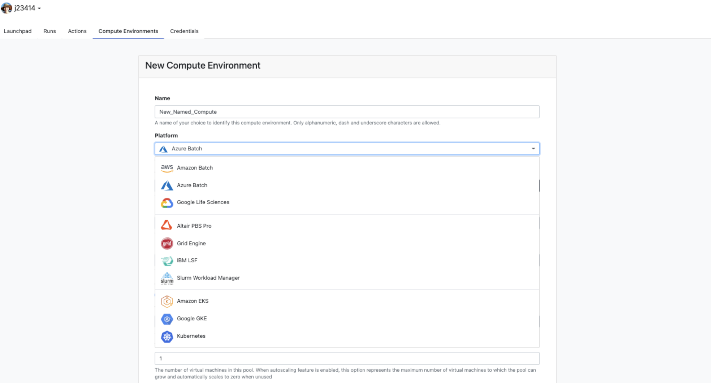

# mini_nf

* Pytest for nextflow - https://nf-co.re/events/2021/bytesize-17-pytest-workflow
* Nope, try to find a cram tests instead
* Nextflow Tower - https://cloud.tower.nf/
  * Computing options



<details><summary>prior notes</summary>

```
# Test run
nextflow run main.nf -stub-run
```

### Option 0.1: Pull data from a url

```
nextflow run main.nf \
  --input_url "https://github.com/nextstrain/zika-tutorial/archive/refs/heads/master.zip"
```

Output:

```
N E X T F L O W  ~  version 21.10.6
Launching `main.nf` [zen_swanson] - revision: 89120e33aa
executor >  local (1)
[e5/a0ed73] process > wget_url (1)         [100%] 1 of 1, cached: 1 ✔
[95/98cace] process > nextstrain_build (1) [100%] 1 of 1 ✔
Completed at: 06-Jan-2022 16:29:02
Duration    : 1m 35s
CPU hours   : (a few seconds)
Succeeded   : 1
Cached      : 1
```

### Option 1: Wrap everything in one process

```
nextflow run main.nf \
  --input_dir "path/to/zika-tutorial"
```

Output:

```
N E X T F L O W  ~  version 21.04.3
Launching `main.nf` [soggy_liskov] - revision: 28e8bf36de
executor >  local (1)
[ce/52d024] process > nextstrain_build (1) [100%] 1 of 1 ✔

Completed at: 29-Dec-2021 13:05:12
Duration    : 2m 42s
CPU hours   : (a few seconds)
Succeeded   : 1

ls -1 results

#> results/
#>   |_ zika-tutorial/
#>       |_ auspice/zika.json   #<= this one!
#>       |_ results/            # other intermediate files
```

### Option 2: Wrap each module in a process

```
nextflow run main.nf \
  --sequences "data/sequences.fasta" \
  --metadata "data/metadata.tsv" \
  --exclude "data/dropped_strains.txt" \
  --reference "data/zika_outgroup.gb" \
  --colors "data/colors.tsv" \
  --lat_longs "data/lat_longs.tsv" \
  --auspice_config "data/auspice_config.json"
```

Output:

```
N E X T F L O W  ~  version 21.04.3
Launching `main.nf` [scruffy_elion] - revision: ae2b2117f5
executor >  local (9)
[55/4d3a4a] process > index (1)     [100%] 1 of 1 ✔
[67/43577b] process > filter (1)    [100%] 1 of 1 ✔
[87/554798] process > align (1)     [100%] 1 of 1 ✔
[20/cf2861] process > tree (1)      [100%] 1 of 1 ✔
[58/dd4a84] process > refine (1)    [100%] 1 of 1 ✔
[24/e74540] process > ancestral (1) [100%] 1 of 1 ✔
[44/0b2945] process > translate (1) [100%] 1 of 1 ✔
[b7/ef345b] process > traits (1)    [100%] 1 of 1 ✔
[a4/a8271c] process > export (1)    [100%] 1 of 1 ✔
WARN: Task runtime metrics are not reported when using macOS without a container engine
Completed at: 29-Dec-2021 13:25:19
Duration    : 1m 46s
CPU hours   : (a few seconds)
Succeeded   : 9

ls -1 results

#> results/
#>   |_ sequences_filtered.fasta
#>   |_ sequences.fasta
#>   |_ sequences_index.tsv
#>   |_ sequences_filtered_aligned.fasta
#>   |_ sequences_filtered_aligned_raw.nwk
#>   |_ sequences_filtered_aligned_branch_lengths.json
#>   |_ sequences_filtered_aligned.nwk
#>   |_ sequences_filtered_aligned_traits.json
#>   |_ sequences_filtered_aligned_nt_muts.json
#>   |_ sequences_filtered_aligned_aa_muts.json
#>   |_ auspice/                                 #<= this one!
#>   |_ report.html
#>   |_ timeline.html
```

## Notes

Build a dockerimage

```
# Start docker desktop
docker build . -t ncov_doc # Assume Dockerfile in current directory

# Interactive session
docker run -it ncov_doc
```

## Debug notes

Nextflow creates a `work` directory where it stores cached intermediate files and scripts. Each hashed directory matches the hash in the print out field (e.g. `fa/60fdb1`) so you can check inputfile scope for each process. Less likely to have filename collisions.

```
$ nextflow run main.nf --input_dir zika-tutorial
N E X T F L O W  ~  version 21.10.6
Launching `main.nf` [scruffy_cajal] - revision: ae2b2117f5
executor >  local (1)
[fa/60fdb1] process > nextstrain_build (1) [100%] 1 of 1 ✔
WARN: Task runtime metrics are not reported when using macOS without a container engine

$ find work/
work/
  |_ conda/          # <= if you use -profile conda, stores env
  |_ singularity/    # <= if you use -profile singularity, stores imgs
  |
  |_ fa/
    |_ f60fdb1c0a50c25844caab3be389369/
      |_ zika-tutorial/       #<= input
      |  |_ auspice/          #<= output
      |  |_ results/
      |
      |_ .command.sh
      |_ .command.begin
      |_ .command.run
      |_ .exitcode
      |_ .command.log
      |_ .command.trace
      |
      |_ .command.err        #<= check these files to debug
      |_ .command.out
```

</details>

## Other Workflows

Create subworkflows to check if modules are generalizable.

**zika.nf**

Pulls the zika github repo. Similar behavior can be used for pulling default reference files.

```
nextflow run zika.nf

N E X T F L O W  ~  version 21.10.6
Launching `zika.nf` [trusting_magritte] - revision: 7490729bc1
executor >  local (11)
[a1/b4ff73] process > ZIKA_EXAMPLE_PIPE:pull_zika        [100%] 1 of 1 ✔
[d4/dc9107] process > ZIKA_EXAMPLE_PIPE:mk_zika_channels [100%] 1 of 1 ✔
[2a/031a76] process > ZIKA_EXAMPLE_PIPE:index (1)        [100%] 1 of 1 ✔
[39/b7224c] process > ZIKA_EXAMPLE_PIPE:filter (1)       [100%] 1 of 1 ✔
[64/4b5003] process > ZIKA_EXAMPLE_PIPE:align (1)        [100%] 1 of 1 ✔
[56/6db4da] process > ZIKA_EXAMPLE_PIPE:tree (1)         [100%] 1 of 1 ✔
[8f/8cdaf6] process > ZIKA_EXAMPLE_PIPE:refine (1)       [100%] 1 of 1 ✔
[b9/64e0c3] process > ZIKA_EXAMPLE_PIPE:ancestral (1)    [100%] 1 of 1 ✔
[61/dc4012] process > ZIKA_EXAMPLE_PIPE:translate (1)    [100%] 1 of 1 ✔
[fb/49cc4c] process > ZIKA_EXAMPLE_PIPE:traits (1)       [100%] 1 of 1 ✔
[a5/f41da6] process > ZIKA_EXAMPLE_PIPE:export (1)       [100%] 1 of 1 ✔
Completed at: 19-Jan-2022 16:57:08
Duration    : 1m 4s
CPU hours   : (a few seconds)
Succeeded   : 11
```

**ncov-simplest.nf**

Assuming all dependencies are installed (seqkit, ebay tsv-filter, fuzzywuzzy, click) and on PATH

```
nextflow run ncov-simplest.nf

N E X T F L O W  ~  version 21.10.6
Launching `ncov-simplest.nf` [intergalactic_panini] - revision: c463dc300f
executor >  local (6)
[16/1e470f] process > NCOV_SIMPLEST_PIPE:pull_ncov_simplest              [100%] 1 of 1, cached: 1 ✔
[4a/1fa10d] process > NCOV_SIMPLEST_PIPE:mk_ncov_simplest_channels       [100%] 1 of 1, cached: 1 ✔
[a0/a67471] process > NCOV_SIMPLEST_PIPE:get_build_specific_channels (6) [100%] 6 of 6, cached: 6 ✔
[e5/832217] process > NCOV_SIMPLEST_PIPE:download_nextclade_dataset (1)  [100%] 1 of 1, cached: 1 ✔
[f9/fa5b69] process > NCOV_SIMPLEST_PIPE:download_lat_longs (1)          [100%] 1 of 1, cached: 1 ✔
[04/6d2380] process > NCOV_SIMPLEST_PIPE:download_sequences (1)          [100%] 1 of 1, cached: 1 ✔
[33/347e01] process > NCOV_SIMPLEST_PIPE:download_metadata (1)           [100%] 1 of 1, cached: 1 ✔
[2a/55bb6f] process > NCOV_SIMPLEST_PIPE:extract_omicron_metadata (1)    [100%] 1 of 1, cached: 1 ✔
[5b/73930b] process > NCOV_SIMPLEST_PIPE:get_omicron_strain_names (1)    [100%] 1 of 1, cached: 1 ✔
[c4/2bf344] process > NCOV_SIMPLEST_PIPE:extract_omicron_sequences (1)   [100%] 1 of 1, cached: 1 ✔
[a1/48c389] process > NCOV_SIMPLEST_PIPE:create_index (1)                [100%] 1 of 1, cached: 1 ✔
[bc/b7aa83] process > NCOV_SIMPLEST_PIPE:filter_meta (1)                 [100%] 2 of 2, cached: 2 ✔
[78/063ff8] process > NCOV_SIMPLEST_PIPE:subsample_meta (2)              [100%] 2 of 2, cached: 2 ✔
[a5/902899] process > NCOV_SIMPLEST_PIPE:join_ref_meta (2)               [100%] 2 of 2, cached: 2 ✔
[27/f11cdc] process > NCOV_SIMPLEST_PIPE:exclude_outliers (2)            [100%] 2 of 2, cached: 2 ✔
[db/c95e4f] process > NCOV_SIMPLEST_PIPE:join_ref_fasta (2)              [100%] 2 of 2, cached: 2 ✔
[ec/a94c86] process > NCOV_SIMPLEST_PIPE:nextclade (1)                   [100%] 2 of 2, cached: 2 ✔
[42/2c0bb1] process > NCOV_SIMPLEST_PIPE:mask (2)                        [100%] 2 of 2, cached: 2 ✔
[d1/046906] process > NCOV_SIMPLEST_PIPE:nextclade_after_mask (2)        [100%] 2 of 2, cached: 2 ✔
[3f/689c80] process > NCOV_SIMPLEST_PIPE:tree (2)                        [100%] 2 of 2, cached: 2 ✔
[a8/dcfeab] process > NCOV_SIMPLEST_PIPE:refine (2)                      [100%] 2 of 2, cached: 2 ✔
[11/9699c8] process > NCOV_SIMPLEST_PIPE:ancestral (2)                   [100%] 2 of 2, cached: 2 ✔
[eb/76e810] process > NCOV_SIMPLEST_PIPE:ancestral_unmasked (2)          [100%] 2 of 2, cached: 2 ✔
[ae/5f2bc6] process > NCOV_SIMPLEST_PIPE:translate (4)                   [100%] 4 of 4, cached: 4 ✔
[37/525a42] process > NCOV_SIMPLEST_PIPE:recency (2)                     [100%] 2 of 2, cached: 2 ✔
[70/bd3c82] process > NCOV_SIMPLEST_PIPE:export (2)                      [100%] 2 of 2 ✔
```

View the results

```
nextstrain view results_build/auspice/
```

```
ls -1tr results_build

results_build/
  |_ downloads/
  |  |_ lat_longs.tsv
  |  |_ metadata.tsv.gz
  |  |_ sequences.fasta.xz
  |
  |_ sars-cov-2/
  |
  |_ gisaid.index
  |_ gisaid.fasta.gz
  |
  |_ Omicron/
  |  |_ metadata_omicron.tsv
  |  |_ omicron_strain_names.txt
  |  |_ gisaid.fasta.gz
  |
  |_ 21K/
  |  |_ nextclade/
  |  |_ metadata.tsv
  |  |_ tree_raw.nwk
  |  |_ tree.nwk
  |  |_ ...
  |
  |_ 21L/ 
  |
  |_ auspice/
  |  |_ 21K.json
  |  |_ 21L.json
  |
  |_ report.html
  |_ timeline.html
```
 
* [ ] what's happening with translate (should this be all genes?)

**ncov-ingest.nf**

```
nextflow run ncov-ingest.nf -resume

N E X T F L O W  ~  version 21.10.6
Launching `ncov-ingest.nf` [awesome_archimedes] - revision: b322d1ecd1
executor >  local (1)
[1b/dfdc9d] process > NCOV_INGEST_PIPE:pull_ncov_ingest     [100%] 1 of 1, cached: 1 ✔
[5f/2afc78] process > NCOV_INGEST_PIPE:fetch_from_biosample [100%] 1 of 1 ✔
```

**run_octoFLU.nf**

```
nextflow run PATH/TO/mini_nf/run_octoflu.nf \
  --query_fasta input.fasta \
  -resume

N E X T F L O W  ~  version 21.10.6
Launching `/Users/jenchang/github/j23414/mini_nf/run_octoflu.nf` [magical_fermi] - revision: 234c78072f
[07/0ab44b] process > run_octoFLU (1) [100%] 1 of 1, ✔
```

results

```
Downloads/octoFLU-master/input.fasta_output/
  |_ H3.tre  #<= check quality of tree
  |_ H3_aln.fa
  |_ N2.tre   
  |_ N2_aln.fa
  |_ ... other 6 segments
  |_ blast_output.txt
  |_ input.fasta_Final_Output.txt #<= clade assignments
```

## rsv

```
(nextstrain) mini_nf % nextflow run rsv.nf -resume
N E X T F L O W  ~  version 21.10.6
Launching `rsv.nf` [silly_ardinghelli] - revision: a56fd99116
executor >  local (13)
[74/197ec1] process > fetch_config_files            [100%] 1 of 1, cached: 1 ✔
[e0/4d31c2] process > vipr_fetch_rsv (1)            [100%] 1 of 1, cached: 1 ✔
[62/c1f140] process > subset_to_small (1)           [100%] 1 of 1 ✔
[f1/c5a778] process > format_downloaded_genomes (1) [100%] 1 of 1 ✔
[8d/5b65c8] process > parse (1)                     [100%] 1 of 1 ✔
[8b/8176a4] process > filter (1)                    [100%] 1 of 1 ✔
[3a/a2e309] process > align (1)                     [100%] 1 of 1 ✔
[e1/9024b6] process > tree (1)                      [100%] 1 of 1 ✔
[fb/4f52d8] process > refine (1)                    [100%] 1 of 1 ✔
[93/3836e0] process > ancestral (1)                 [100%] 1 of 1 ✔
[82/96e95d] process > translate (1)                 [100%] 1 of 1 ✔
[6a/c09a99] process > export (1)                    [100%] 1 of 1 ✔
[c6/512661] process > label_rsv_subtypes (1)        [100%] 1 of 1 ✔
[98/421d58] process > mafft (1)                     [100%] 2 of 2 ✔
[/Users/jenchang/github/j23414/mini_nf/work/36/cc5e6b5545ee6da0531ee848332af6/rsv_B_genome_aln.fna, F]
[/Users/jenchang/github/j23414/mini_nf/work/36/cc5e6b5545ee6da0531ee848332af6/rsv_B_genome_aln.fna, G]
[/Users/jenchang/github/j23414/mini_nf/work/98/421d5872a6fed8a5b1374d16017842/rsv_A_genome_aln.fna, F]
[/Users/jenchang/github/j23414/mini_nf/work/98/421d5872a6fed8a5b1374d16017842/rsv_A_genome_aln.fna, G]
WARN: Task runtime metrics are not reported when using macOS without a container engine
Completed at: 19-May-2022 17:34:29
Duration    : 4m
CPU hours   : 0.1 (39.5% cached)
Succeeded   : 13
Cached      : 2
```
